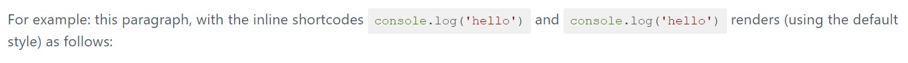
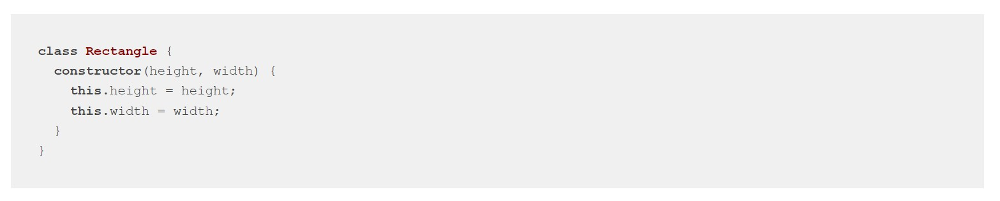

# Highlight PHP Plugin

The **Highlight PHP** Plugin is an extension for [Grav
CMS](http://github.com/getgrav/grav) that provides server-side syntax
highlighting (i.e., without JavaScript) using the
[highlight.php](https://github.com/scrivo/highlight.php) library.

## Installation

Installing the Highlight PHP plugin can be done in one of three ways: The GPM
(Grav Package Manager) installation method lets you quickly install the plugin
with a simple terminal command, the manual method lets you do so via a zip file,
and the admin method lets you do so via the Admin Plugin.

### GPM Installation (Preferred)

To install the plugin via the [GPM](http://learn.getgrav.org/advanced/grav-gpm),
through your system's terminal (also called the command line), navigate to the
root of your Grav-installation, and enter:

    bin/gpm install highlight-php

This will install the Highlight PHP plugin into your `/user/plugins`-directory
within Grav. Its files can be found under
`/your/site/grav/user/plugins/highlight-php`.

### Manual Installation

To install the plugin manually, download the zip-version of this repository and
unzip it under `/your/site/grav/user/plugins`. Then rename the folder to
`highlight-php`. You can find these files on
[GitHub](https://github.com/iainsgillis/grav-plugin-highlight-php) or via
[GetGrav.org](http://getgrav.org/downloads/plugins#extras).

You should now have all the plugin files under

    /your/site/grav/user/plugins/highlight-php
	
> NOTE: This plugin is a modular component for Grav requires the [shortcode core
> plugin](https://github.com/getgrav/grav-plugin-shortcode-core) operate, please
> see its [blueprints.yaml-file on
> GitHub](https://github.com/iainsgillis/grav-plugin-highlight-php/blob/master/blueprints.yaml).

### Admin Plugin

If you use the Admin Plugin, you can install the plugin directly by browsing the
`Plugins`-menu and clicking on the `Add` button.

## Configuration

Before configuring this plugin, you should copy the
`user/plugins/highlight-php/highlight-php.yaml` to
`user/config/plugins/highlight-php.yaml` and only edit that copy.

Here is the default configuration and an explanation of available options:

```yaml
enabled: true                           # turn the plugin on or off
theme: default                          # basename of the active CSS filename
custom_styles: highlight-php-styles     # directory name, under /user/custom where custom user styles may be added
```

Note that if you use the Admin Plugin, a file with your configuration named
highlight-php.yaml will be saved in the `user/config/plugins/`-folder once the
configuration is saved in the Admin.

## Usage

Install & enable the plugin; select one of the builtin themes or add your own to
the `/user/custom/<custom_styles>` directory. The plugin works globally;
currently no page-level frontmatter overrides are supported.

Only [explicit mode](https://github.com/scrivo/highlight.php#explicit-mode) is
supported; this is by design.

To enter an inline, syntax-highlighted code snippet, use a self-closing
shortcode, where the BbCode value is a [supported language name (or an
alias)](https://github.com/scrivo/highlight.php/tree/master/src/Highlight/languages),
and the `code` parameter is the snippet to be parsed.

For example: this paragraph, with the raw forms of
`[hl=javascript code="console.log('hello')"]` and `[hl=js code="console.log('hello')"]` renders
(using the default style) as follows:



To enter a block-level, syntax-highlighted code snippet, use paired shortcodes
passing a supported language name (or alias) as the BbCode value, and the
content between the tags is your content. For example, to render, with syntax
highlighting, a snippet on [JavaScript class declarations taken from the MDN
documentation](https://developer.mozilla.org/en-US/docs/Web/JavaScript/Reference/Classes#class_expressions),
you could enter:

```
[hl=js]
class Rectangle {
  constructor(height, width) {
    this.height = height;
    this.width = width;
  }
}
[/hl]
```

and get back:




## Credits

This plugin wouldn't be possible with the great work of:

- the [Grav core team/Trilby Media](https://trilby.media/our-team), and other
  [contributors](https://github.com/getgrav/grav/graphs/contributors), for
  [Grav](https://getgrav.org/) and the [Shortcode Core
  plugin](https://github.com/getgrav/grav-plugin-shortcode-core);
- Thomas Kowalczyk ([@thunderer](https://github.com/thunderer),
  https://kowalczyk.cc/) for the underlying [shortcode
  engine](https://github.com/thunderer/Shortcode);
- Igor Sagalaev ([@isagalaev](https://github.com/isagalaev),
  https://softwaremaniacs.org/), and other
  [contributors](https://github.com/highlightjs/highlight.js/graphs/contributors),
  for [highlight.js](https://highlightjs.org/); and
- Vladimir Jimenez ([@allejo](https://github.com/allejo), https://allejo.io/),
  Geert Bergman ([@scrivo](https://github.com/scrivo)), and other
  [contributors](https://github.com/scrivo/highlight.php/graphs/contributors),
  for [highlight.php](https://github.com/scrivo/highlight.php).


## To Do

- [ ] Add additional shortcode options/aliases?
- [ ] Maybe add a CLI

